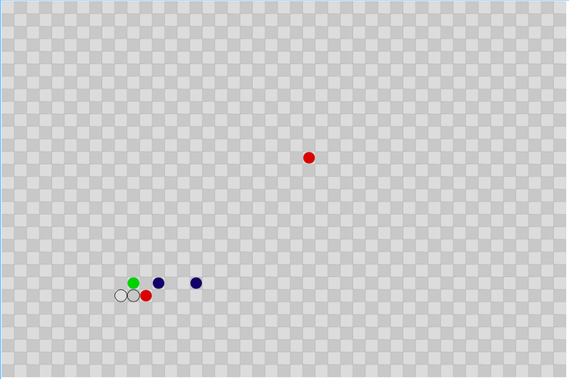

# Rules of the Game

*Fig 1*

The board is a grid of spaces.
There is one human (green),
one or more robots (blue),
and zero or more explosions (red).

Robots is a turn-based game.
The human has 9 directional 
